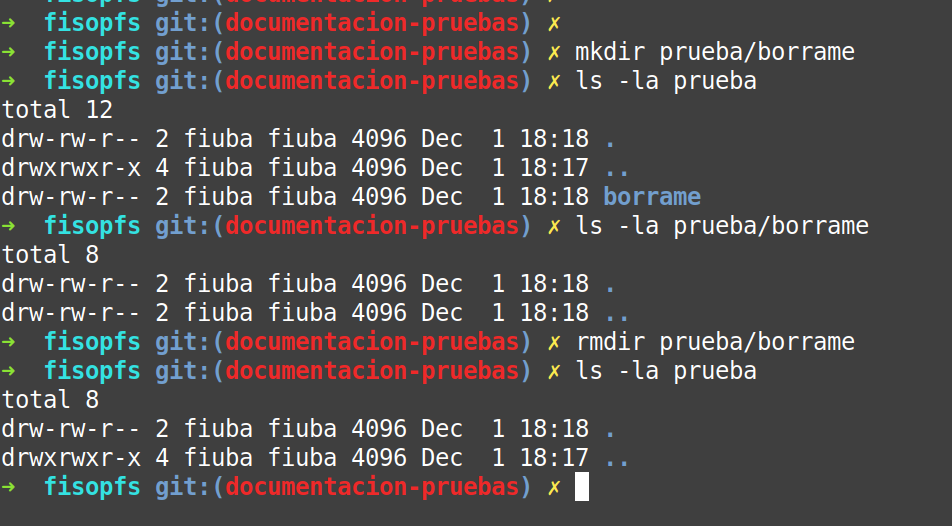
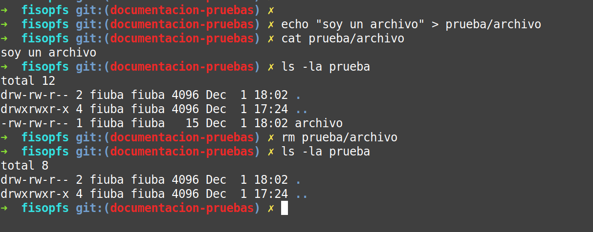
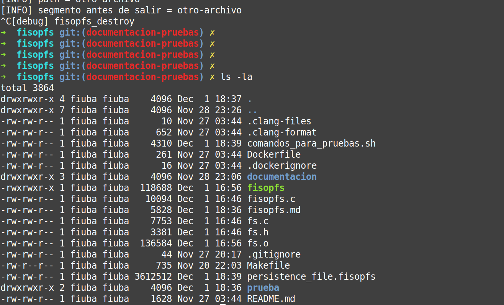

# fisop-fs

## Introito
A grandes rasgos implementamos algo similar al _vsfs_ explicado en _Operating Systems: Three Easy Pieces_. 

Tenemos un sector de máscara de _inodos_ para poder ubicar los bloques libres y un sector de datos dividido en bloques. El bloque puede contener o un archivo o un directorio.

## Generalidades

- Nuestro _filesystem_ se implementa con un arreglo de bloques de 4K.
- Cada archivo ocupa un bloque. 
- Cada archivo puede ser un archivo regular o un directorio.
- Hay un número limitado y fijo de _inodos_ y bloques.
- Un _inodo_ es una estructura que contiene metadata de un archivo.
- Cada bloque se corresponde a un _inodo_ del siguiente modo:
    - El primer inodo (0) se corresponde con el primer bloque (0)
    - En el primer bloque se encuentra el directorio raíz.
    - El inodo _n_ corresponde al bloque _n_.
- Un directorio es una estructura que contiene un arreglo de _dirents_
- Un _dirent_ es una estructura que contiene un número de _inodo_ y un nombre.

Entonces un directorio guarda nombres de archivos con sus respectivos números de _inodo_.

## Esquema de las estructuras del fs


## Búsqueda de archivo en _path_

Se comienza desde la raíz (bloque 0, entrada 0) y se descompone el _path_ sucesivamente hasta hallar su _inodo_. Si el archivo no existiese se retorna -1.

Para facilitar la creación de archivos al buscar un archivo en el _path_ también se obtiene el "padre" del archivo en cuestion.

## Persistencia

Al montar el _filesystem_ en la función `fisopfs_init` se verifica la existencia de `filedisk`. En caso de existir se lo lee y carga en memoria.

Al momento de desmontar el _filesystem_ en la función `fisopfs_destroy` se sobreescribe el archivo `filedisk`.

# Pruebas

## Montar el fs

### Comandos:

```sh
mkdir prueba
./fisopfs -f prueba 
mount | grep fisopfs
```

### Capturas:


## Crear directorios (un nivel)

### Comandos:

```sh
mkdir prueba
./fisopfs -f prueba
mkdir prueba/nuevo-dir-nivel-1
ls -la prueba
ls -la prueba/nuevo-dir-nivel-1
stat prueba/nuevo-dir-nivel-1
```

### Capturas:


## Crear directorios (dos niveles)

### Comandos:

```sh
mkdir prueba
./fisopfs -f prueba
mkdir prueba/nuevo-dir-nivel-1
mkdir prueba/nuevo-dir-nivel-1/nuevo-dir-nivel-2
ls -la prueba/nuevo-dir-nivel-1
ls -la prueba/nuevo-dir-nivel-1/nuevo-dir-nivel-2
stat prueba/nuevo-dir-nivel-1
stat prueba/nuevo-dir-nivel-1/nuevo-dir-nivel-2
```

### Capturas:


## Directorios - borrar vacío

### Comandos:

```sh
mkdir prueba
./fisopfs -f prueba
mkdir prueba/borrame
ls -la prueba
ls -la prueba/borrame
rmdir prueba/borrame
ls -la prueba
```

### Capturas:


## Directorios - borrar con contenido (`rmdir`, `rm -r`)

### Comandos:

```sh
mkdir prueba
./fisopfs -f prueba
mkdir prueba/borrame
echo "hola" > prueba/borrame/archivo
ls -la prueba
ls -la prueba/borrame
rmdir prueba/borrame
ls -la prueba
cat prueba/borrame/archivo
rm -r prueba/borrame
ls -la prueba
```

### Capturas:


## Archivos - crear archivo vacío

### Comandos:

```sh
mkdir prueba
./fisopfs -f prueba
ls -la prueba
touch prueba/archivo
ls -la prueba
ls -la prueba/archivo
stat prueba/archivo
# limpiar
rmdir prueba
rm persistence_file.fisopfs
```

### Capturas:


## Archivos - crear archivo con contenido (`echo`) - leer archivo (`cat`)

### Comandos:

```sh
mkdir prueba
./fisopfs -f prueba
ls -la prueba
echo "soy un archivo" > prueba/archivo
ls -la prueba/archivo
cat prueba/archivo
stat prueba/archivo

```

### Capturas:


## Archivos - leer archivo (`more`, `less`, `vim`)

### Comandos:

```sh
more prueba/archivo
less prueba/archivo
vim prueba/archivo
```

### Capturas:


## Archivos - sobreescribir (truncar)

### Comandos:

```sh
mkdir prueba
./fisopfs -f prueba
echo "soy un archivo" > prueba/archivo
cat prueba/archivo
echo "nuevo contenido" > prueba/archivo
cat prueba/archivo
```

### Capturas:


## Archivos - sobreescribir (_append_)

### Comandos:

```sh
mkdir prueba
./fisopfs -f prueba
echo "soy un archivo" > prueba/archivo
cat prueba/archivo
echo "nuevo contenido" >> prueba/archivo
cat prueba/archivo
```

### Capturas:


## Archivos - borrar (`rm`)

### Comandos:

```sh
mkdir prueba
./fisopfs -f prueba
echo "soy un archivo" > prueba/archivo
cat prueba/archivo
ls -la prueba
rm prueba/archivo
ls -la prueba
```

### Capturas:




## Persistencia (_filedisk_ _default_)

Usar el _filedisk_ por defecto. 


### Comandos:

```sh
# Parte 1. Montar por primera vez.
# mostrar que fs no existe
ls
mkdir prueba
./fisopfs -f prueba 
ls -la prueba
stat prueba
# crear directorio y archivesco
mkdir prueba/persistencia
echo "soy un archivo persistente" > prueba/archivo
echo "yo tambien soy un archivo persistente" > prueba/persistencia/otro-archivo
ls -la prueba
ls -la prueba/persistencia
# terminar el proceso fisopfs con ctrl c y mostrar que el fs existe
ls -la 

# Parte 2. Volver a montarlo
./fisopfs -f prueba
ls -la prueba
cat prueba/archivo
cat prueba/persistencia/otro-archivo

```

### Capturas:

Antes de montar:


Montamos y creamos archivos:


Desmontamos y se crea el archivo de persistencia (`persistence_file.fisopfs`)


Volvemos a montarlo:


Comprobamos que los archivos existen:


## Persistencia (_filedisk_ provisto)

Usar el _filedisk_ que se pasa como argumento. 

### Comandos:

```sh
# Parte 1. Montar por primera vez.
# mostrar que fs no existe
ls
mkdir prueba
./fisopfs -f --filedisk persistencia-personalizada prueba
ls -la prueba
stat prueba
# crear directorio y archivesco
mkdir prueba/persistencia
echo "soy un archivo persistente" > prueba/archivo
echo "yo tambien soy un archivo persistente" > prueba/persistencia/otro-archivo
ls -la prueba
ls -la prueba/persistencia
# terminar el proceso fisopfs con ctrl c y mostrar que el fs existe
ls -la 

# Parte 2. Volver a montarlo
./fisopfs -f --filedisk persistencia-personalizada prueba
ls -la prueba
cat prueba/archivo
cat prueba/persistencia/otro-archivo

```

### Capturas:

Antes de montar:


Montamos y creamos archivos:


Desmontamos y se crea el archivo de persistencia (`persistencia-personalizada`)


Volvemos a montarlo:


Comprobamos que los archivos existen:


